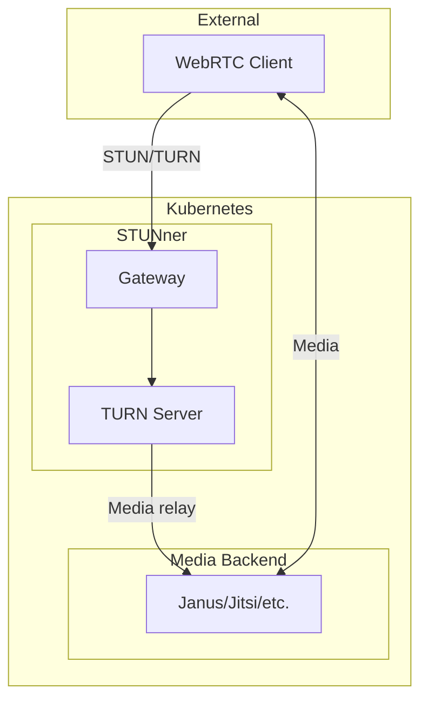
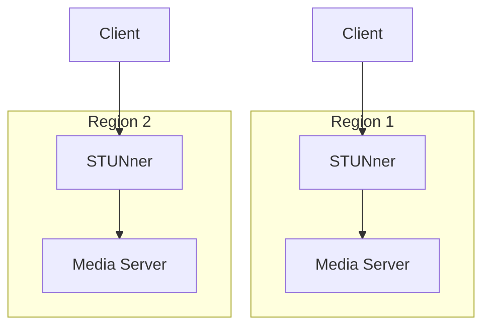

# ADR: STUNner WebRTC Gateway

**Status:** Accepted
**Date:** 2024-10-01
**Updated:** 2026-01-16

## Context

Need WebRTC support for real-time communication that:
- Handles STUN/TURN NAT traversal
- Works in Kubernetes environments
- Integrates with Istio service mesh
- Supports media server backends

## Decision

Use **STUNner** as the optional WebRTC gateway for applications requiring real-time communication.

## Architecture



## Why STUNner?

| Challenge | STUNner Solution |
|-----------|------------------|
| NAT traversal | Built-in TURN relay |
| K8s networking | Gateway API native |
| Service mesh | Works with Istio |
| Scalability | Horizontal pod scaling |

## Features

| Feature | Support |
|---------|---------|
| STUN | UDP binding discovery |
| TURN | Media relay |
| ICE | Interactive connectivity |
| TLS | Encrypted signaling |
| UDP/TCP | Both transport modes |
| Gateway API | Native K8s integration |

## Configuration

### Gateway

```yaml
apiVersion: gateway.networking.k8s.io/v1
kind: Gateway
metadata:
  name: stunner-gateway
  namespace: stunner
spec:
  gatewayClassName: stunner-gatewayclass
  listeners:
    - name: udp-listener
      port: 3478
      protocol: TURN-UDP
    - name: tcp-listener
      port: 3478
      protocol: TURN-TCP
    - name: tls-listener
      port: 5349
      protocol: TURN-TLS
      tls:
        mode: Terminate
        certificateRefs:
          - name: stunner-tls
```

### UDPRoute for Media Server

```yaml
apiVersion: stunner.l7mp.io/v1
kind: UDPRoute
metadata:
  name: media-server-route
  namespace: <tenant>
spec:
  parentRefs:
    - name: stunner-gateway
      namespace: stunner
  rules:
    - backendRefs:
        - name: janus-media
          namespace: <tenant>
```

### GatewayConfig

```yaml
apiVersion: stunner.l7mp.io/v1
kind: GatewayConfig
metadata:
  name: stunner-config
  namespace: stunner
spec:
  realm: <domain>
  authRef:
    name: stunner-auth
    namespace: stunner
  logLevel: info
```

### Authentication

```yaml
apiVersion: stunner.l7mp.io/v1
kind: StaticService
metadata:
  name: stunner-auth
  namespace: stunner
spec:
  type: static
  credentials:
    - username: <tenant>
      password:
        secretKeyRef:
          name: stunner-credentials
          key: password
```

## Media Server Integration

### Janus Example

```yaml
apiVersion: apps/v1
kind: Deployment
metadata:
  name: janus-gateway
  namespace: <tenant>
spec:
  template:
    spec:
      containers:
        - name: janus
          image: canyan/janus-gateway:latest
          env:
            - name: STUN_SERVER
              value: "stunner-gateway.stunner.svc.cluster.local:3478"
          ports:
            - containerPort: 8088  # HTTP
            - containerPort: 8188  # WebSocket
            - containerPort: 20000 # RTP range start
              protocol: UDP
```

## Multi-Region Considerations



**Recommendation:** Deploy STUNner in each region for lowest latency. Media sessions should stay within a single region when possible.

## Consequences

**Positive:**
- Kubernetes-native WebRTC
- Gateway API integration
- Scalable TURN relay
- Works with any media server

**Negative:**
- Requires UDP traffic (firewall considerations)
- Media relay increases bandwidth usage
- Not needed for all applications

## When to Use

| Use Case | Recommended |
|----------|-------------|
| Video conferencing | Yes |
| Live streaming (viewer) | Maybe (HLS/DASH may suffice) |
| Screen sharing | Yes |
| VoIP | Yes |
| Game streaming | Yes |

## Related

- [ADR-ISTIO-SERVICE-MESH](../../istio/docs/ADR-ISTIO-SERVICE-MESH.md)
- [SPEC-PLATFORM-TECH-STACK](../../handbook/docs/specs/SPEC-PLATFORM-TECH-STACK.md)
